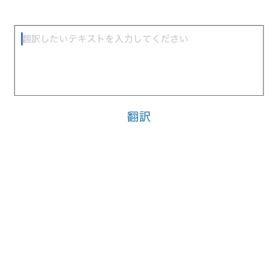

# @sh1r4s4g1/react-native-translation-module



iOS17.4以上に追加された標準APIである "Translation"を利用し、React Nativeのアプリ上で簡単に翻訳機能を実装できます！
Using the "Translation", a standard API added to iOS 17.4 and above, you can easily implement translation functionality on React Native apps!

- Framework Translation
  https://developer.apple.com/documentation/Translation
- translationPresentation(isPresented:text:attachmentAnchor:arrowEdge:replacementAction:)
  https://developer.apple.com/documentation/swiftui/view/translationpresentation(ispresented:text:attachmentanchor:arrowedge:replacementaction:)

showTranslationPopoverに文字列を与えてください！翻訳結果をPromise<string>で返します。途中で変換をキャンセルした場合、変換前の文字列がPromise<string>で返却されます。
Just give the showTranslationPopover a string! The translation result is returned as a Promise<string>. If you cancel the translation in the middle, the string before the translation is returned in Promise<string>.

```js
const translatedText = await showTranslationPopover('Hello, world!');
```

ユーザーが辞書をダウンロードすれば、オンデバイスでオフライン翻訳を実現することも可能です。
If the user downloads a dictionary, it is also possible to achieve offline translation on-device.

ぜひ試してみてください！
Please give it a try!

## Installation

```sh
npm install @sh1r4s4g1/react-native-translation-module
```

or

```sh
yarn add @sh1r4s4g1/react-native-translation-module
```

## Usage

```js
import { showTranslation } from '@sh1r4s4g1/react-native-translation-module';

// ...

try {
  const translatedText = await showTranslationPopover('Hello, world!');
  console.log('Translated text:', translatedText);
} catch (error) {
  console.error('Translation error:', error);
}
```

## Example

```js
import { useState } from 'react';
import { StyleSheet, View, TextInput, Button } from 'react-native';
import { showTranslationPopover } from 'react-native-translation-module';

export default function App() {
  const [text, setText] = useState('');

  const handleTranslation = async () => {
    if (text.trim()) {
      const result = await showTranslationPopover(text);
      setText(result);
    }
  };

  return (
    <View style={styles.container}>
      <TextInput
        style={styles.textArea}
        multiline
        numberOfLines={4}
        onChangeText={setText}
        value={text}
        placeholder="Enter text to translate"
      />
      <Button title="Translate" onPress={handleTranslation} />
    </View>
  );
}

const styles = StyleSheet.create({
  container: {
    flex: 1,
    alignItems: 'center',
    justifyContent: 'center',
    padding: 20,
  },
  textArea: {
    width: '100%',
    height: 100,
    borderColor: 'gray',
    borderWidth: 1,
    marginBottom: 10,
    padding: 10,
  },
});
```

## iOS Setup

This module only supports iOS. To use it in an iOS project, follow these steps:

1. Run the following command in the root directory of your project to install the necessary dependencies:

```sh
yarn pod-install
```

or

```sh
npm run pod-install
```

2. Open your project in Xcode and set up any necessary permissions or settings.

## Contributing

See the [contributing guide](CONTRIBUTING.md) to learn how to contribute to the repository and the development workflow.

## License

MIT

---

Made with [create-react-native-library](https://github.com/callstack/react-native-builder-bob)
